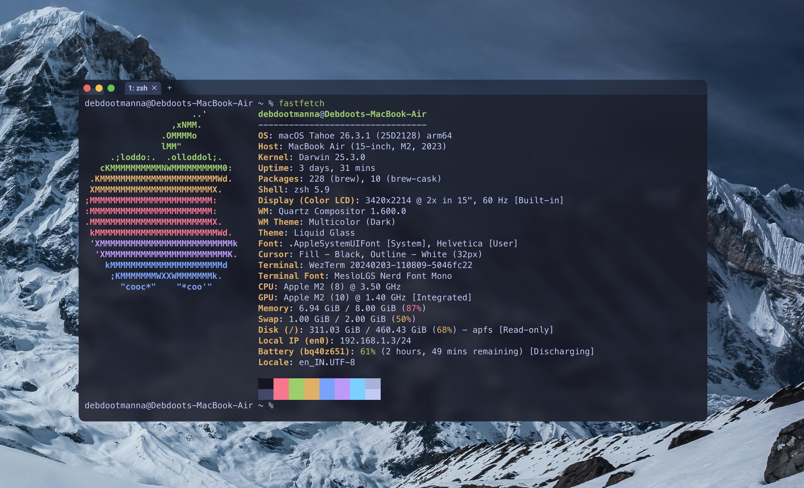

# WezTerm Glass TokyoNight Config

A macOS-focused WezTerm setup with:

- Tokyo Night theme
- Transparent glass background with blur
- Blurred title/tab chrome
- Traffic lights visible
- Tabs always visible
- Window size/position persistence
- Custom keybindings for line and word navigation

## Preview

## Highlights

- Theme: `tokyonight`
- Renderer: `OpenGL`
- Native integrated window buttons enabled
- Smoothness tuning for reduced wobble during window movement

## Key UX Choices

- `Cmd + Left/Right`: Move to start/end of line
- `Cmd + Backspace`: Delete to beginning of line
- `Option + Left/Right`: Move by word
- `Option + Backspace`: Delete previous word

## Notes

- Blur/transparency behavior depends on macOS window compositor performance.
- If needed, tune `window_background_opacity` and `macos_window_background_blur` for your machine.

## Usage

1. Copy the config into your `~/.wezterm.lua`.
2. Restart WezTerm.
3. Enjoy the glassy Tokyo Night setup.
